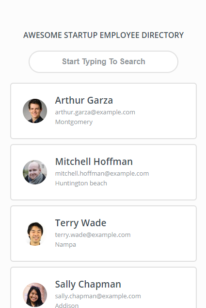
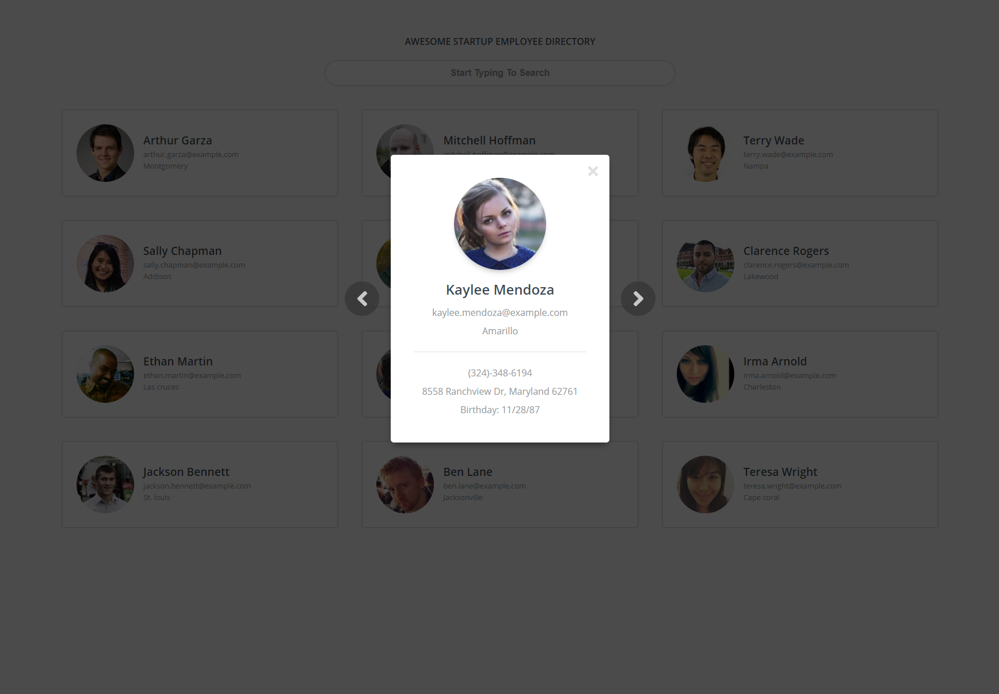
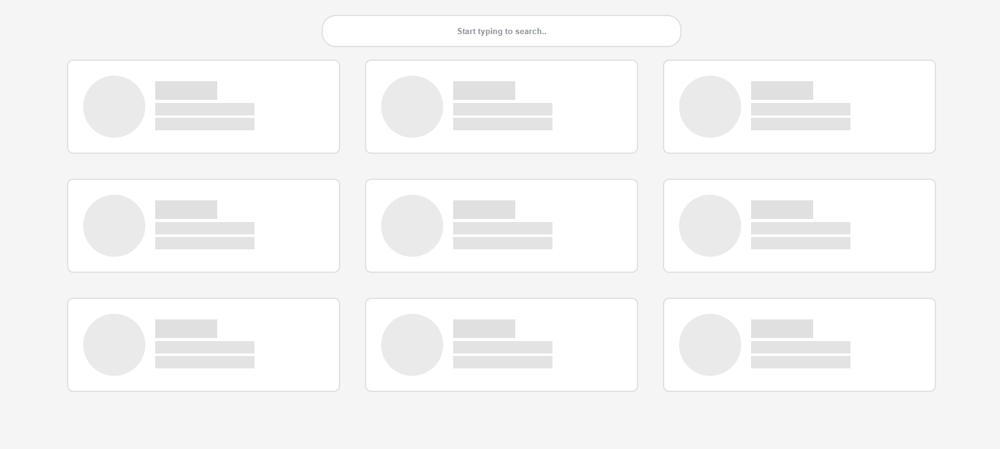

# Employee Directory Project

## How To Run this App

> Fork it, `npm intsall` then `npm start`

## Description

This is an overhaul with _React_ of my other project. Click on the links to check out other versions I made for this exact same project:

- [Vanilla JS version](https://github.com/patrickmao93/techdegree-project-8)

- [React with Redux version](https://github.com/patrickmao93/Employee-directory-with-redux)

During the making of this version, I got the inspiration of loading handling from YouTube and Discord, and then tried to implement my version of showing mockup of the page when page is loading. Please check it out in screenshots section.

## Screenshots

Small Screen Size

    

Medium Screen Size

    

Large Screen Size

    

Modal UI

    

Loading Screen

    

